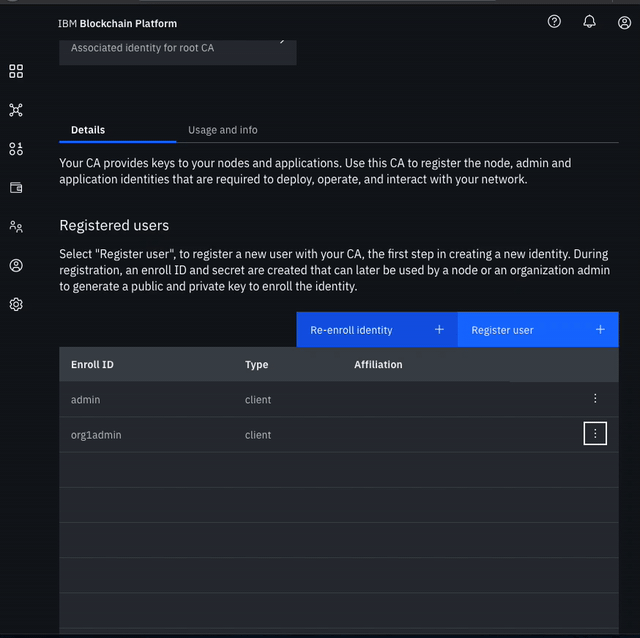
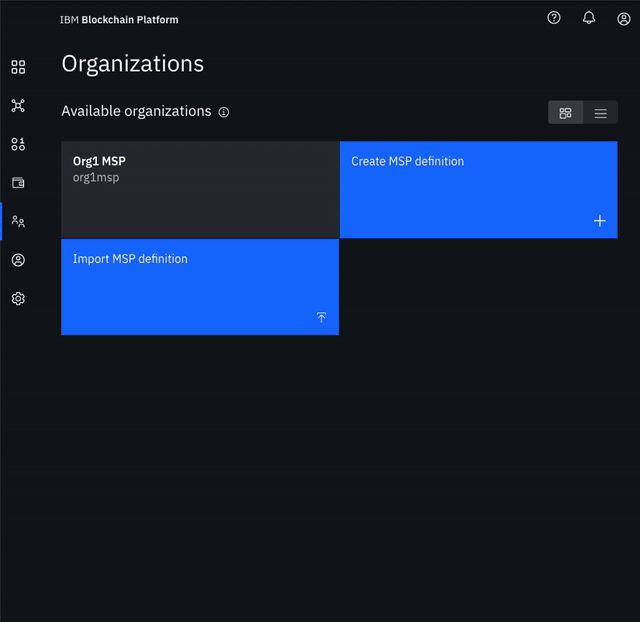

# Lab 4a: FabCar Blockchain Sample - Build a Network \(1/3\)

 **NOTE:** The identity is not stored in your console or managed by IBM. It is only stored in local browser storage. If you change browsers, you will need to import this identity into your Wallet to be able to operate the CA. Click **Export identity** to download the identity and keys.

----

### Create your organization and your entry point to your blockchain

* **Create your peer organization CA**
  * Click **Add Certificate Authority**.
  * Click **IBM Cloud** under **Create Certificate Authority** and **Next**.
  * Give it a **CA display name** of `Org1 CA`.
  * Specify an **Admin ID** of `admin` and **Admin Secret** of `adminpw`.

* **Use your CA to register identities**
  * In **Nodes** Select the **Org 1 CA** Certificate Authority that we created.
  * First, we will register an admin for our organization "org1". Click on the **Register User** button. Give an **Enroll ID** of `org1admin`, and **Enroll Secret** of `org1adminpw`. Click **Next**. Set the **Type** for this identity as `client` and select from any of the affiliated organizations from the drop-down list. We will leave the **Maximum enrollments** and **Add Attributes** fields blank.
  * We will repeat the process to create an identity of the peer. Click on the **Register User** button. Give an **Enroll ID** of `peer1`, and **Enroll Secret** of `peer1pw`. Click **Next**. Set the **Type** for this identity as `peer` and select from any of the affiliated organizations from the drop-down list. We will leave the **Maximum enrollments** and **Add Attributes** fields blank.

* **Create the peer organization MSP definition**
  * Navigate to the **Organizations** tab in the left navigation and click **Create MSP definition**.
  * Enter the **MSP Display name** as `Org1 MSP` and an **MSP ID** of `org1msp`.
  * Under **Root Certificate Authority** details, specify the peer CA that we created `Org1 CA` as the root CA for the organization.
  * Give the **Enroll ID** and **Enroll secret** for your organization admin, `org1admin` and `org1adminpw`. Then, give the Identity name, `Org1 Admin`.
  * Click the **Generate** button to enroll this identity as the admin of your organization and export the identity to the wallet. Click **Export** to export the admin certificates to your file system. Finally click **Create MSP definition**.

* **Create a peer**
  * On the **Nodes** page, click **Add peer**.
  * Click **IBM Cloud peer** under Create a new peer and **Next**.
  * Give your peer a **Display name** of `Peer Org1`.
  * On the next screen, select `Org1 CA` as your **Certificate Authority**. Then, give the **Enroll ID** and **Enroll secret** for the peer identity that you created for your peer, `peer1`, and `peer1pw`. Then, select the **Administrator Certificate \(from MSP\)**, `Org1 MSP`, from the drop-down list and click **Next**.
  * Give the **TLS Enroll ID**, `admin`, and **TLS Enroll secret**, `adminpw`, the same values are the Enroll ID and Enroll secret that you gave when creating the CA. Leave the **TLS CSR hostname** blank.
  * The last side panel will ask you to **Associate an identity** and make it the admin of your peer. Select your peer admin identity `Org1 Admin`.
  * Review the summary and click **Submit**.

